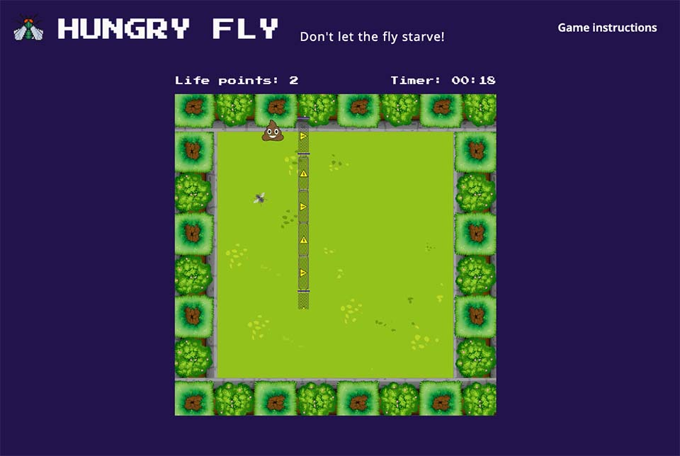

# Hungry Fly

## Description
"Hungry Fly" is an arcade-inspired web-based game where the player must move quickly to collect targets and avoid obstacles.
The game is built using the following technologies:

- Vanilla JavaScript
- HTML5
- CSS3

## How to play
A fly is hungry and needs your help! Move the fly using the arrow keys. Collect targets (represented by poop emojis) that you'll find along the way. Be cautious, as the neighbor Bob has installed electric obstacles that you must avoid.

## The game
Here you can play "Hungry Fly":  
[>>> Go to the game](https://marvlas.github.io/hungry-fly/help.html/)

## MVP
The player can be moved and needs to hit targets popping up and disappearing from the board.

## Milestones

### Milestone 1
- [x]  Player initial position and size
- [x]  Player movement by pressing keyboards keys
- [x]  Targets position and size 
- [x]  Targets popping up randomly and disappearing

### Milestone 2
- [x]  Collision condition and formula
- [x]  Lives decreasing automatically
- [x]  Lives increasing when target is hit
- [x]  Setting board limits for player
- [x]  Create obstacles
- [x]  Lives decreases when obstacle is hit

### Milestone 3
- [x]  Game over condition
- [x]  Improve player movement smoothness
- [x]  UX / UI
    - [x] Fly image
    - [x] Background image
    - [x] Obstacle image
    - [x] UI Colors
    - [x] Fly sound 
    - [x] Electricity sound 
    - [x] Smashed poo 
    - [x] UI Fixes
- [x]  *Bonus* - Build timer
- [ ]  *Bonus* - Increase game speed after a certain amount of time
- [x]  *Bonus* - Add diagonal movement

